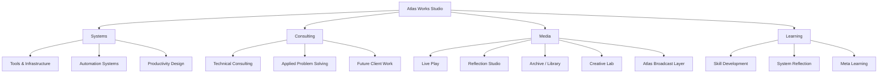
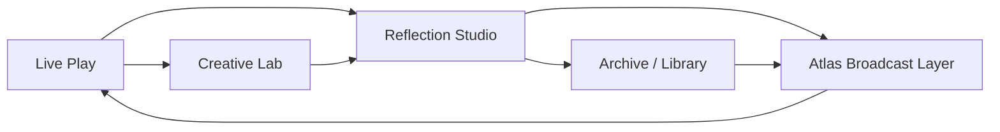
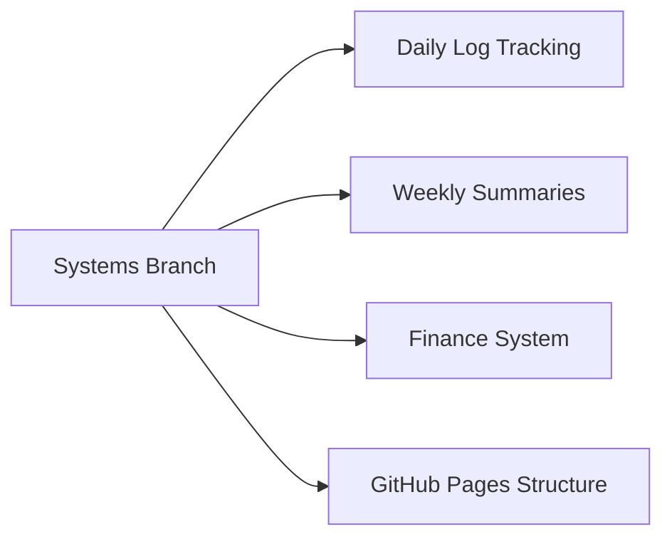
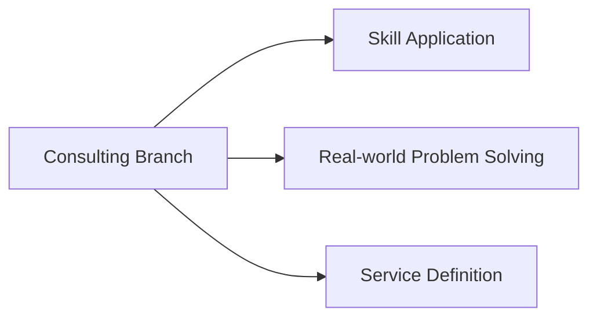
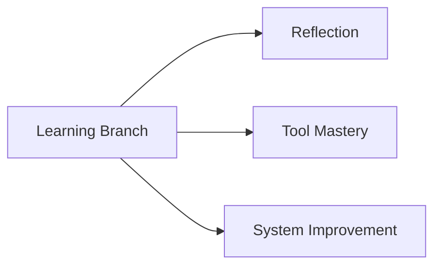
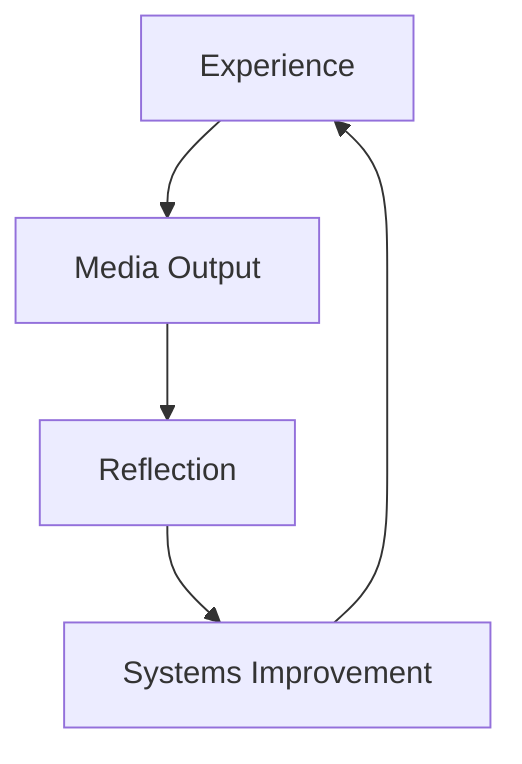

# Atlas Works Studio — Idea Map

A systems map of Atlas Works Studio showing how all branches connect and interact.

---

## 🌐 Core Structure


---

## 🔁 Media Flow System



---

## 🧠 Systems Flow



---

## 💼 Consulting Flow



---

## 🌱 Learning Flow



---

## 🧭 Key Insight

Atlas Works Studio is not a linear workflow.

It is a **multi-branch system where outputs loop back into inputs.**

Each branch reinforces the others:

- Systems enable Media
- Media generates Reflection
- Reflection improves Systems
- Consulting applies everything externally
- Learning stabilizes the whole system

---

## 🔄 Meta Loop



---

## 🌐 Current Active Focus

- 🎮 Media (Live Play)
- 🧠 Systems (tracking + infrastructure setup)

Other branches are active but not currently primary.

---

## 🧭 Philosophy

Atlas Works Studio evolves through:

- iteration
- reflection
- systemization
- expression

Not through fixed structure, but through continuous feedback loops.
```
